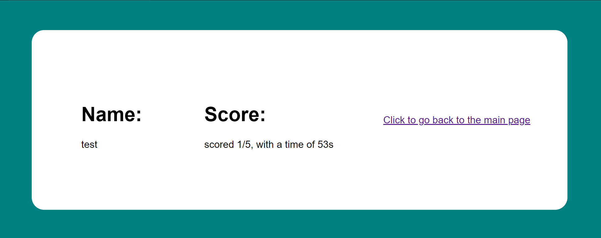

# leynor-octo-mawson

This week we were tasked with creating a Javascript for beginners with basic questions.

The web page asks you five simple questions with four multiple choice answers. Afterwards you are prompted to enter your username and then are redirected to a scoreboard containing your time, socre and name.

# links

[Deployed quiz](https://abdalehhersi.github.io/leynor-octo-mawson/)

[My github profile](https://github.com/AbdalehHersi)

[Password generator repository](https://github.com/AbdalehHersi/leynor-octo-mawson/tree/main)

# screenshots of the deployed page

# challenges

<li>Accessing user objects from a different page</li>
<li>Using a single event listener for each button</li>
<li>Displaying user score in a list correctly</li>

# Successes

<li>Cycling through different questions and answer options</li>
<li>Storing user inputs on local storage</li>
<li>Hiding and showing different sections</li>

# Application requirements

<li>When the user clicks the start button
then a timer starts and user is presented with a question</li>
<li>When the user answers a question
then the user is presented with another question</li>
<li>When the user answers a question incorrectly
then time is subtracted from the clock</li>
<li>When all questions are answered or the timer reaches 0
then the game is over</li>
<li>When the game is over
then the user can save my initials and score</li>